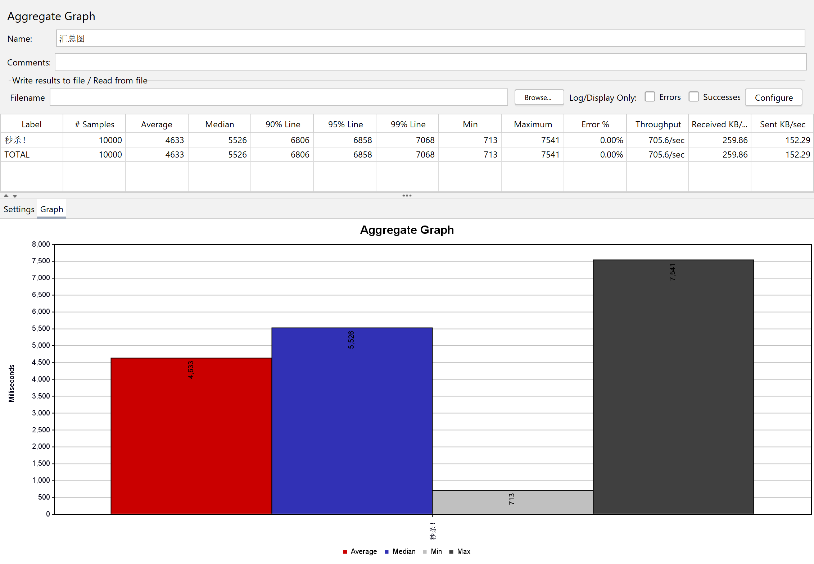

# Spring 与 Redis 整合学习案例

通过一个秒杀系统学习 redis 以及与 spring 整合的案例。

## 使用技术

- spring boot
- spring security
- spring jpa/hibernate
- redis
- rabbitmq
- mysql
- thymeleaf

## 路线图

- [X] 纯数据库，悲观锁实现
- [x] redis 缓存
- [ ] rabbitmq 异步下单

## 如何运行

暂时没有其他依赖，直接怼就行

## 性能测试

mysql & 悲观锁:

